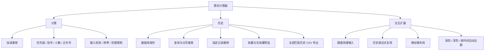
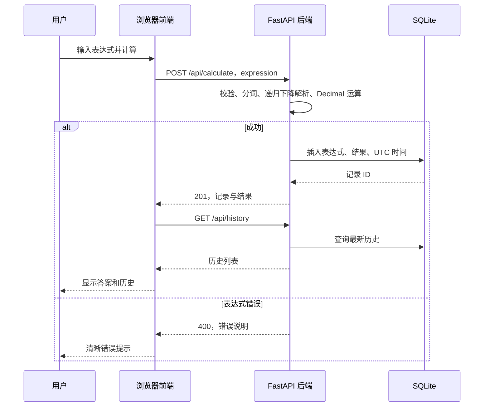

# 系统架构与实现说明

## 功能结构



## 计算流程



## 前后端职责

前端只维护输入、DOM 状态、请求和分页搜索参数。后端生成计算结果并存入数据库。浏览器不使用本地存储来保存历史，断开后端连接后不会产生新的有效结果。

生产环境由 Nginx 提供静态页面并转发 `/api`，静态托管不改变前后端代码和职责的分离。

## 安全表达式解析

语法：

```text
expression := term ((+ | -) term)*
term       := unary ((* | /) unary)*
unary      := (+ | -) unary | number | '(' expression ')'
```

`term` 层先计算乘除，`expression` 层再计算加减，括号递归调用表达式层。数字通过正则分词，所有其他字符拒绝。整个过程没有 Python 代码执行。界面的乘除符号会在后端规范化为 `*` 和 `/`。

Decimal 精度为 50 位有效数字，采用 ROUND_HALF_EVEN 舍入。`0.1+0.2` 得到字符串 `0.3`；循环小数按精度截取／舍入。返回字符串避免 JSON 数字在浏览器中丢失精度。

## 数据库

```sql
CREATE TABLE calculation_history (
    id INTEGER PRIMARY KEY AUTOINCREMENT,
    expression TEXT NOT NULL,
    result TEXT NOT NULL,
    created_at TEXT NOT NULL,
    is_favorite INTEGER NOT NULL DEFAULT 0 CHECK (is_favorite IN (0, 1))
);
```

每次操作单独建立并关闭连接，写入提交事务，SQL 参数使用绑定。WAL 模式改善读写并发。成功计算先写库再返回；失败不插入历史。查询按 ID 倒序，搜索匹配表达式或结果；删除使用记录 ID，删除后前端重新查询。

旧数据库在启动时通过 `PRAGMA table_info` 检查字段，缺少收藏字段时执行增量 ALTER，不重建或清空表。收藏接口采用 PATCH 显式设置布尔状态；查询和导出共用参数化筛选条件，搜索与收藏取交集。

## 扩展功能实现

- 主题：CSS 变量统一提供浅色／深色配色，首屏脚本在渲染前选择主题。自动模式以浏览器本机小时判断 07:00–19:00 浅色、其余深色；定时检查对齐下一分钟，回到页面时立即更新。手动模式优先，LocalStorage 仅保存主题偏好，不保存计算历史。
- 收藏：数据库字段 `is_favorite` 持久保存。星标按钮调用 PATCH API，更新后重新查询；“仅收藏”支持搜索、分页及取消收藏后的列表更新。
- CSV：后端查询所有符合当前筛选的记录，使用 Python csv.writer 输出标准 CSV，附加 UTF-8 BOM 和下载响应头。前端下载 Blob 并释放对象 URL。导出不依赖页面当前加载的十条数据。

## 异常处理

400 表示表达式非法或不能计算；422 表示 API 参数格式错误；404 表示删除记录不存在；503 表示数据库操作失败。前端统一处理非成功响应和 12 秒超时，提示服务不可用，编辑表达式时清除上一次答案，避免把旧结果误当成新结果。

历史查询采用请求序号，避免较早请求返回后覆盖最新搜索结果。删除最后一页的最后一条记录后自动退回有效页。

## 部署与后续范围

Windows：两个独立服务在 8080/8000 通过 CORS 通信。Linux Docker：Nginx 与后端通过内部网络通信，数据库使用持久卷；可选 Caddy 提供域名 HTTPS。

当前历史是全应用共享记录，未实现账户和用户隔离；没有科学函数或单位换算。PSP、个人心得、仓库链接和公网访问地址需在实际开发与部署后填写。
